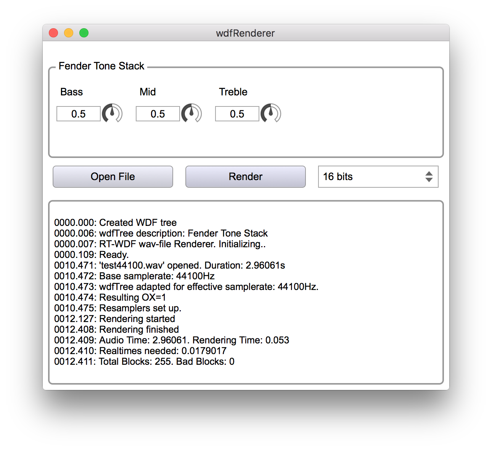

# wdfRenderer
This application accompanies the [RT-WDF library](https://github.com/RT-WDF/rt-wdf_lib) by hosting RT-WDF circuit trees, creating their user interface and processing audio through them.




The repository is divided into three parts:

## Circuits
Demo circuits of different complexity are supplied with the renderer as a starting point for your own models. Some of them are explained in great detail in a [DAFx-16 paper](https://github.com/RT-WDF/rt-wdf_lib/tree/master/Documentation/40-DAFx-16_paper_35-PN.pdf). 

## Libs
This folder hosts the [JUCE](https://github.com/julianstorer/JUCE) audio/gui framework, the sample rate conversion library [r8brain-free](https://github.com/avaneev/r8brain-free-src) and the [RT-WDF library](https://github.com/RT-WDF/rt-wdf_lib) as git submodules.

## wdfRenderer
The wdfRenderer is an offline audio renderer which processes .wav files through WDF trees and writes an output file rtwdf.wav into your home directory. It is a cross-platform standalone app based on [JUCE](https://github.com/julianstorer/JUCE).
    
# Dependencies
wdfRenderer depends on [JUCE](https://github.com/julianstorer/JUCE), [r8brain-free](https://github.com/avaneev/r8brain-free-src), the [RT-WDF library](https://github.com/RT-WDF/rt-wdf_lib) and [armadillo](http://arma.sourceforge.net/).

# Getting started
After checking out the main code repository, initialize the dependencies as git submodules with 

```
git submodule init
git submodule update
```

They will be automatically at the correct revision.

Also, make sure to provide [armadillo](http://arma.sourceforge.net/) and it's dependencies. This can either be a pre-compiled version (`libarmadillo-dev` for linux, `armadillo` with homebrew for MacOS) or built from scratch.

On MacOS, you can build the project on the command line with 

```
xcodebuild -project wdfRenderer.xcodeproj -alltargets -configuration Release
```

## Updating dependencies
To update one of the git submodules to another revision or change their codebase, `cd` into the desired submodule folder within [Libs](/Libs) and pull/checkout/change it.
Then, commit your changes into the submodule repository if necessary and return to the main repo. A new file at the location of the submodule should indicate in your `git status` that the submodule has changed. Add and commit that file and you're all done.
If you see such a file after a `git pull` from the remote host, you need to run `git submodule update` again to get up to date.

# Contact
Drop a line to rt-wdf@e-rm.de to get in touch!
